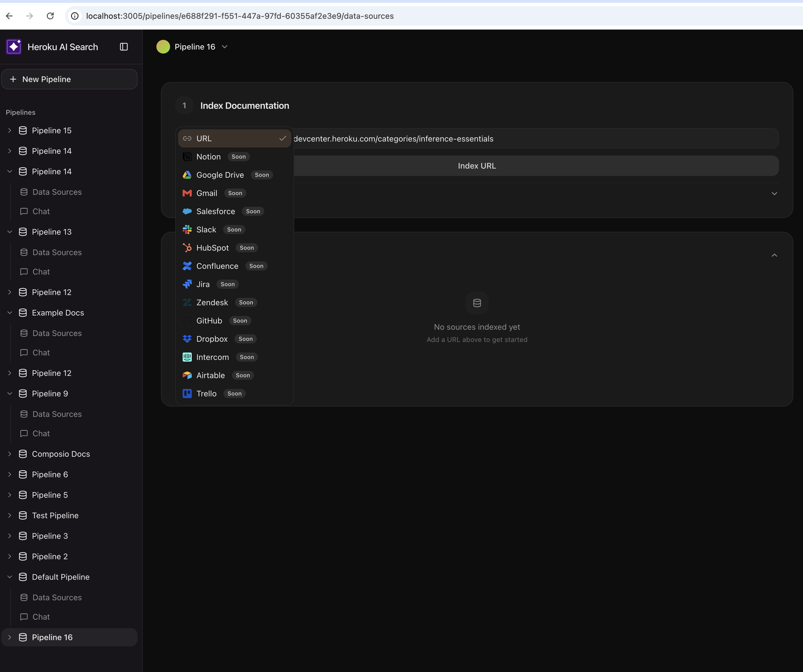
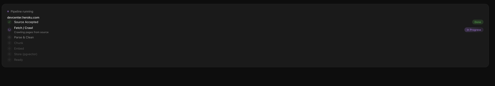
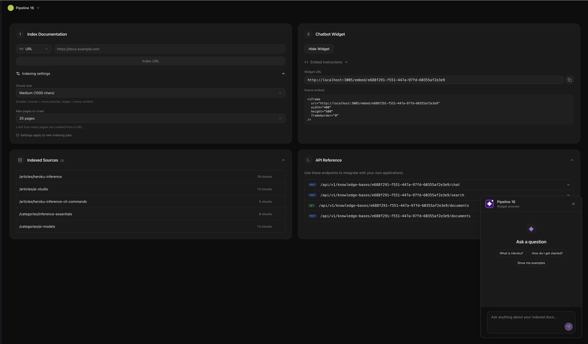
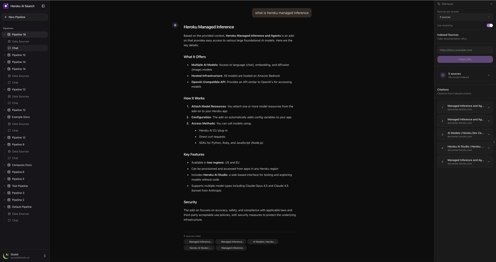

# MIA - AI Documentation Assistant

A sample implementation of a **managed AI search service** using RAG pipelines with **embeddings**, **reranking**, and **pgvector** - powered by Heroku Managed Inference.

[](https://heroku.com/deploy?template=https://github.com/dsouza-anush/heroku-rag-chatbot)

## Features

- **Index any documentation** - Crawl and index URLs automatically
- **AI-powered chat** - Ask questions, get answers with citations
- **Multiple pipelines** - Create separate knowledge bases for different docs
- **Embeddable widget** - Add to your site with a simple script tag
- **Real-time streaming** - See responses as they're generated

## Screenshots

### 1. Index Documentation

Connect to multiple data sources including URLs, with support for Notion, Google Drive, Salesforce, Slack, and more coming soon.



### 2. RAG Pipeline

Watch your documents flow through the full RAG pipeline: Fetch, Parse, Chunk, Embed, and Store in pgvector.



### 3. Embeddable Chatbot Widget

Get an embeddable widget for your indexed documentation. Copy the iframe code or widget URL to add AI-powered search to any website.



### 4. Chat with Citations & Reranking

Ask questions and get grounded answers with source citations. Toggle Cohere Rerank to improve retrieval precision.



## Heroku AI Primitives

| Primitive | Purpose |
|-----------|---------|
| **Cohere Embed** | Vectorize documents and queries |
| **Cohere Rerank 3.5** | Improve retrieval precision |
| **Claude Sonnet** | Generate answers from context |
| **Postgres + pgvector** | Vector storage and similarity search |

## Quick Start

### Deploy to Heroku

1. Click the **Deploy to Heroku** button above
2. Create the required AI model add-ons:

```bash
heroku addons:create heroku-inference:cohere-embed-multilingual
heroku addons:create heroku-inference:cohere-rerank-3-5
heroku addons:create heroku-inference:claude-3-5-sonnet
```

3. Set environment variables from the add-ons:

```bash
# Get the config vars from each addon and set them
heroku config:set EMBEDDING_URL=<from cohere-embed addon>
heroku config:set EMBEDDING_KEY=<from cohere-embed addon>
heroku config:set RERANKING_URL=<from cohere-rerank addon>
heroku config:set RERANKING_KEY=<from cohere-rerank addon>
heroku config:set INFERENCE_URL=<from claude addon>
heroku config:set INFERENCE_KEY=<from claude addon>
```

### Local Development

```bash
# Clone the repo
git clone https://github.com/dsouza-anush/heroku-rag-chatbot
cd heroku-rag-chatbot/frontend

# Install dependencies
npm install

# Set environment variables
cp .env.example .env.local
# Edit .env.local with your credentials

# Run development server
npm run dev
```

Open [http://localhost:3000](http://localhost:3000)

## Architecture

```
┌─────────────────────────────────────────────────────────────────┐
│                         MIA CHATBOT                              │
└─────────────────────────────────────────────────────────────────┘

 INDEXING PIPELINE
 ─────────────────
 URL → Crawl → Chunk → Cohere Embed → pgvector

 QUERY PIPELINE
 ──────────────
 Question → Embed → Vector Search → Rerank → Claude → Answer
```

## API Endpoints

### Create Pipeline
```bash
POST /api/pipelines
{ "name": "My Docs", "description": "Documentation for my project" }
```

### Index a URL
```bash
POST /api/pipelines/:id/index
{ "url": "https://docs.example.com", "max_pages": 20 }
```

### Chat
```bash
POST /api/pipelines/:id/chat
{ "message": "How do I get started?" }
```

### Get Status
```bash
GET /api/pipelines/:id/status
```

## Environment Variables

| Variable | Description |
|----------|-------------|
| `DATABASE_URL` | Postgres connection string (auto-set by addon) |
| `INFERENCE_URL` | Claude API endpoint |
| `INFERENCE_KEY` | Claude API key |
| `EMBEDDING_URL` | Cohere Embeddings endpoint |
| `EMBEDDING_KEY` | Cohere Embeddings API key |
| `RERANKING_URL` | Cohere Rerank endpoint |
| `RERANKING_KEY` | Cohere Rerank API key |
| `AUTH_SECRET` | NextAuth session secret |

## Tech Stack

- **Frontend**: Next.js 16, React 19, Tailwind CSS, shadcn/ui
- **Database**: PostgreSQL with pgvector extension
- **AI**: Heroku Managed Inference (Cohere, Claude)

## License

MIT
